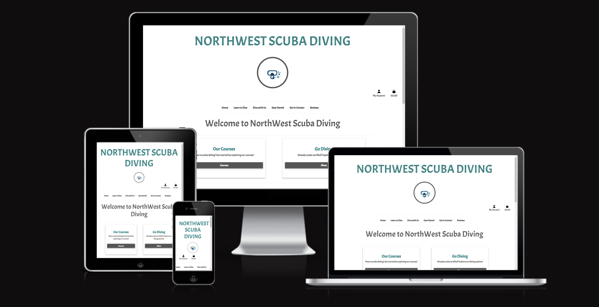
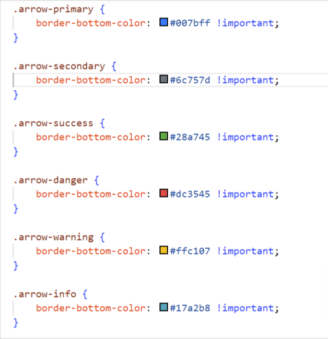

Font used for main site header: Acme
json formatter.org
https://dashboard.stripe.com/test/logs?method%5B0%5D=post&method%5B1%5D=delete&direction%5B0%5D=self&direction%5B1%5D=connect_in&success=true&showIP=false

# Northwest Scuba Diving
## Portfolio Project 5 - Ecommerce
### This ecommerce site was built for Portfolio Project Five of the Code Institutes Diploma in Software Development.
### This ecommerce site was built to be a dive schools platform for allowing customers to get in contact to organsise dives and to purchase their diving experiences. The target customer base is people who are interested in learnig to dive and those who are already divers and want to dive in a different location.

------------------------------------------------------------------
### Lisa Butler
------------------------------------------------------------------

------------------------------------------------------------------

## View the live site here
**[Live Site](https://northwest-scubadiving.herokuapp.com/)**

## View the Repository here
**[Repository](https://github.com/lisa-butler/Northwest-Scuba-Diving)**

------------------------------------------------------------------
## Contents

 1. [User Experience](#ux)
 2. [Application Features](#features)
 3. [Technology Used](#tech)
 4. [Testing](#testing)
 5. [Bugs](#bugs)
 6. [Deployment](#deploy)
 7. [Credits](#credits)
 8. [Content](#content)

------------------------------------------------------------------
## User Experience

### **Pre project planning**

I decided to create a dive school page to sell a service rather than goods as my ecommerce project as this is a domain that i know quite well. Knowing the domain means i knew what functionality the customer and admin would want avalible. There is no dive school in my area, though i have heard that there used to be one, so it was interesting to think of what could be offered if a dive school was to set up in the region.
Pre project planning involved developing user stories, wireframe mock ups, logic flow diagrams and researching some basic styling ideas.
I also researched the software stack to use for this specific project. As it is Django based i was tied to using Django and Python, however, I looked into using React and various alternatives for Bootstrap. I ultimately ended up usiing Bootstrap and Djangos built in functionality. Styling relied heavily on inline Bootstrap styles, which was very effective.

**Strategy:**

Determining what to include in this ecommerce site involved some research. I looked at several dive school sites both in ireland and abroad to get an idea of what functionality these sites often had. From this i was able to develop user stories for both the customer and the admin of the site.

**User stories:**
### New Site Users

- As a new site user, I would like to register for an account, so that I can save my details to make checkout smoother.
- As a new site user, I would like to register for an account, so that I can login and view my orders.
- As a new site user, I would like to be able to see reviews, so that I can decide if i want to dive with this dive school.
- As a new site user, I would like to be able to contact the dive school, so that I can have my questions answered.

### Returning Site Users

- As a returning site user, I would like to be able to sign in, so that I can view my previous orders.
- As a returning site user, I would like to be able to sign up for a newsletter, so that I can be kept updated about upcoming courses and dive trips.
- As a returning site user, I would like to unsubscribe from a newsletter, so that I can no longer recieve them.
- As a returning site user, I would like to be able to submit  review, so that I can review my experience at the dive school.
- As a returning site user, I would like to be able to contact the dive school, so that I can organise my dives/courses.

### Site Admin

- As a site administrator, I should be able to view customers orders, so that I can take note of numbers signed up for courses/dives.
- As a site administrator, I should be able to gather some data from customers re their diving grade and age, so that I can properly prepare for their visit.
- As a site administrator, I should be able to add, remove and edit products, so that I can keep the avalible courses up to date and add things as they come up.

These were added into the Issues section on Github for effective project planning and moved on the projects board as i progressed through them.

 

GitHub **[Issue Tracker](https://github.com/lisa-butler/My-Dive-Log/issues?q=is%3Aissue+is%3Aclosed)**

GitHub **[Projects Board](https://github.com/users/lisa-butler/projects/3)**

### **Style**

Background: After some experimentation with backgrounds and overlays, it was concluded that a plain white background provided the most visually appealling and accessible style. These benefits for accessibility would enable the older population to have a better chance of navigating the application. A basic icon that was used on an earlier application was selected as this had a nice color pallet and fitted the theme in a visually pleasing way. A small banner of photographs was used to add some life to the quieter pages as was done in previous projects. At this stage i am aware thaat styling is not my strong suit so have elected to keep things simple.

### Colour Scheme
After some experimentation, a white background was chosen as it enabled the content to be very legible and to stand out for the user, making the site more navigatable.

- `Dark Grey` used for primary text as it is high contrast against the white background so is easy to read.
- `Teal` used for main logo text and some highlights as it is a water themed color.
- `Black` used for text as it stands out.
- `Red and Blue` used for edit and delete functionality for admin.

I used CSS Bootstrap convienience classes to apply to all Toasts.

### Typography

Google Fonts and Font Awesome were used to select fonts and icons for this ecommerce site.

- [Acme](https://fonts.google.com/specimen/Acme?query=acme) was used throughout the site as it was clear and legible while also having a water themed style.

- [Font Awesome](https://fontawesome.com/icons) icons were used throughout the site, such as the social media icons in the footer and for the account and shopping bag tabs.

**Scope:**

* The web application should have a clear and consistent layout including navigation and login, logout functionality.
* The web application should be accessible on all devices for divers to log their dives on the go.
* The web application should have a navigation bar that is self explanitory.
* Logging a dive should be as straight forward and quick as possible.
* Reviewing logged dives should be simple and easy with clear viewing.
* Logging in and out should be straight forward and easy to do.
* Viewing club logs should be possible seperately from personal logs so that the diving officer can have one account.
* The application should be easy to use and require as few clicks as possible to log a dive quickly after returing from the water.

