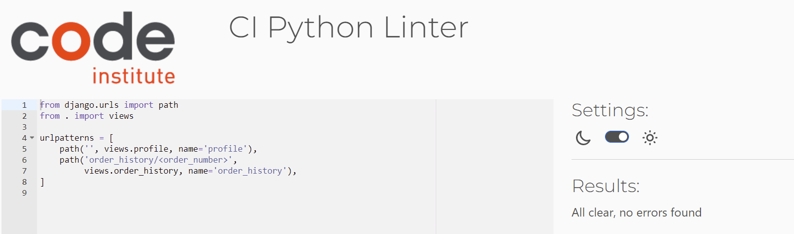

# Testing

## Code Validation

### HTML

I have used the recommended [HTML W3C Validator](https://validator.w3.org) to validate all of my HTML files.

| Page | W3C URL | Screenshot | Notes |
| --- | --- | --- | --- |
| Index.html | https://validator.w3.org/nu/?doc=https%3A%2F%2Fnorthwest-scubadiving.herokuapp.com%2F |  | Warning: Section lacks heading|
|newsletter.html | https://validator.w3.org/nu/?doc=https%3A%2F%2Fnorthwest-scubadiving.herokuapp.com%2Fnewsletter%2F |  | N/A |
| newsletter_signup_success.html | https://validator.w3.org/nu/?doc=https%3A%2F%2Fnorthwest-scubadiving.herokuapp.com%2Fnewsletter%2Fnewsletter_signup_success%2Fl.butler1993%40gmail.com |  | N/A |
| newsletter_unsubscribe | https://validator.w3.org/nu/?doc=https%3A%2F%2Fnorthwest-scubadiving.herokuapp.com%2Fnewsletter%2Fnewsletter_unsubscribe%2Fl.butler1993%40gmail.com |  | N/A |
| add_product.html | https://validator.w3.org/nu/?doc=https%3A%2F%2Fnorthwest-scubadiving.herokuapp.com%2Fproducts%2Fadd%2F |  | INFO: Trailing slash, WARNING: Lacks heading |
| courses.html | https://validator.w3.org/nu/?doc=https%3A%2F%2Fnorthwest-scubadiving.herokuapp.com%2Fproducts%2Fcourses%2F%3Fcategory%3Dcourses |  | N/A |
| edit_product.html | https://validator.w3.org/nu/?doc=https%3A%2F%2Fnorthwest-scubadiving.herokuapp.com%2Fproducts%2Fedit%2F9%2F |  | INFO: Trailing slash, WARNING: Lacks heading |
| gear.html | https://validator.w3.org/nu/?doc=https%3A%2F%2Fnorthwest-scubadiving.herokuapp.com%2Fproducts%2Fgear%2F%3Fcategory%3Dgear_rental |  | N/A |
| orders.html | https://validator.w3.org/nu/?doc=https%3A%2F%2Fnorthwest-scubadiving.herokuapp.com%2Fproducts%2Forders%2F |  | INFO: Trailing slash, WARNING: Lacks heading |
| product_detail.html | https://validator.w3.org/nu/?doc=https%3A%2F%2Fnorthwest-scubadiving.herokuapp.com%2Fproducts%2F5%2F |  | N/A |
| qualified.html | https://validator.w3.org/nu/?doc=https%3A%2F%2Fnorthwest-scubadiving.herokuapp.com%2Fproducts%2Fqualified%2F%3Fcategory%3Dqualified_diver |  | N/A |
| profile.html | https://validator.w3.org/nu/?doc=https%3A%2F%2Fnorthwest-scubadiving.herokuapp.com%2Fprofile%2F |  | INFO: Trailing slash, WARNING: Lacks heading |
| reviews.html | https://validator.w3.org/nu/?doc=https%3A%2F%2Fnorthwest-scubadiving.herokuapp.com%2Freviews%2F |  | N/A |
| submit_review.html | https://validator.w3.org/nu/?doc=https%3A%2F%2Fnorthwest-scubadiving.herokuapp.com%2Freviews%2Fsubmit_review |  | INFO: Trailing slash, WARNING: Lacks heading |
| contact.html | https://validator.w3.org/nu/?doc=https%3A%2F%2Fnorthwest-scubadiving.herokuapp.com%2Fcontact%2F |  | N/A |
| contact_request_success.html | https://validator.w3.org/nu/?doc=https%3A%2F%2Fnorthwest-scubadiving.herokuapp.com%2Fcontact%2Fcontact_request_success%2F8C45853228084254988539FD58BCB154 |  | N/A |
| bag.html | https://validator.w3.org/nu/?doc=https%3A%2F%2Fnorthwest-scubadiving.herokuapp.com%2Fbag%2F |  | N/A |
| 404.html | https://validator.w3.org/nu/#textarea |  | N/A |

------------------------------------------------------------------

### CSS

I have used the recommended [Kigsaw Validator](https://jigsaw.w3.org/css-validator/validator) to validate all of my CSS files.

| File | Jigsaw URL | Screenshot | Notes |
| --- | --- | --- | --- |
| style.css | [Jigsaw](https://jigsaw.w3.org/css-validator/validator?uri=https%3A%2F%2Fnorthwest-scubadiving.herokuapp.com%2F&profile=css3svg&usermedium=all&warning=1&vextwarning=&lang=en) |  | Pass: No Errors |
| checkout.css | n/a |  | Pass: No Errors |

------------------------------------------------------------------

### JavaScript

I have used the recommended [JShint Validator](https://jshint.com) to validate all of my JS files.

| File | Screenshot | Notes |
| --- | --- | --- |
| stripe_elements.js |  | Unidentified Variable: Stripe |
| countryfield.js |  | Pass: No Errors |

------------------------------------------------------------------

### Python

I have used the recommended [CI Python Linter](https://pep8ci.herokuapp.com) to validate all of my Python files.

| File | CI URL | Screenshot | Notes |
| --- | --- | --- | --- |
| BAG contexts.py | [CI PEP8](https://pep8ci.herokuapp.com/https://raw.githubusercontent.com/lisa-butler/Northwest-Scuba-Diving/main/bag/contexts.py) |  | No Errors |
| BAG urls.py | [CI PEP8](https://pep8ci.herokuapp.com/https://raw.githubusercontent.com/lisa-butler/Northwest-Scuba-Diving/main/bag/urls.py) |  | No Errors |
| BAG views.py | [CI PEP8](https://pep8ci.herokuapp.com/https://raw.githubusercontent.com/lisa-butler/Northwest-Scuba-Diving/main/bag/views.py) |  | No Errors |
| ChECKOUT admin.py | [CI PEP8](https://pep8ci.herokuapp.com/https://raw.githubusercontent.com/lisa-butler/Northwest-Scuba-Diving/main/checkout/a.py) |  | No Errors |
| CHECKOUT forms.py | [CI PEP8](https://pep8ci.herokuapp.com/https://raw.githubusercontent.com/lisa-butler/Northwest-Scuba-Diving/main/checkout/forms.py) |  | No Errors |
| CHECKOUT models.py | [CI PEP8](https://pep8ci.herokuapp.com/https://raw.githubusercontent.com/lisa-butler/Northwest-Scuba-Diving/main/checkout/models.py) |  | No Errors |
| CHECKOUT signals.py | [CI PEP8](https://pep8ci.herokuapp.com/https://raw.githubusercontent.com/lisa-butler/Northwest-Scuba-Diving/main/checkout/signals.py) |  | No Errors |
| CHECKOUT urls.py | [CI PEP8](https://pep8ci.herokuapp.com/https://raw.githubusercontent.com/lisa-butler/Northwest-Scuba-Diving/main/checkout/urls.py) |  | No Errors |
| CHECKOUT views.py| [CI PEP8](https://pep8ci.herokuapp.com/https://raw.githubusercontent.com/lisa-butler/Northwest-Scuba-Diving/main/checkout/views.py) |  | No Errors |
| CHECKOUT webhook_handler.py | [CI PEP8](https://pep8ci.herokuapp.com/https://raw.githubusercontent.com/lisa-butler/Northwest-Scuba-Diving/main/checkout/webhook_handler.py) |  | No Errors |
| CHECKOUT webhooks.py | [CI PEP8](https://pep8ci.herokuapp.com/https://raw.githubusercontent.com/lisa-butler/Northwest-Scuba-Diving/main/checkout/webhooks.py) |  |  |
| CONTACT admin.py | [CI PEP8](https://pep8ci.herokuapp.com/https://raw.githubusercontent.com/lisa-butler/Northwest-Scuba-Diving/main/contact/admin.py) |  | No Errors |
| CONTACT forms.py | [CI PEP8](https://pep8ci.herokuapp.com/https://raw.githubusercontent.com/lisa-butler/Northwest-Scuba-Diving/main/contact/forms.py) |  | No Errors |
| CONTACT models.py | [CI PEP8](https://pep8ci.herokuapp.com/https://raw.githubusercontent.com/lisa-butler/Northwest-Scuba-Diving/main/contact/models.py) |  | No Errors |
| CONTACT urls.py | [CI PEP8](https://pep8ci.herokuapp.com/https://raw.githubusercontent.com/lisa-butler/Northwest-Scuba-Diving/main/contact/urls.py) |  | No Errors |
| CONTACT views.py | [CI PEP8](https://pep8ci.herokuapp.com/https://raw.githubusercontent.com/lisa-butler/Northwest-Scuba-Diving/main/contact/views.py) |  | No Errors |
| HOME urls.py | [CI PEP8](https://pep8ci.herokuapp.com/https://raw.githubusercontent.com/lisa-butler/Northwest-Scuba-Diving/main/home/urls.py) |  | No Errors |
| HOME views.py | [CI PEP8](https://pep8ci.herokuapp.com/https://raw.githubusercontent.com/lisa-butler/Northwest-Scuba-Diving/main/home/views.py) |  | No Errors |
| NEWSLETTER forms.py | [CI PEP8](https://pep8ci.herokuapp.com/https://raw.githubusercontent.com/lisa-butler/Northwest-Scuba-Diving/main/newsletter/forms.py) |  | No Errors |
| NEWSLETTER models.py | [CI PEP8](https://pep8ci.herokuapp.com/https://raw.githubusercontent.com/lisa-butler/Northwest-Scuba-Diving/main/newsletter/models.py) |  | No Errors |
| NEWSLETTER urls.py | [CI PEP8](https://pep8ci.herokuapp.com/https://raw.githubusercontent.com/lisa-butler/Northwest-Scuba-Diving/main/newsletter/urls.py) |  | No Errors |
| NEWSLETTER views.py | [CI PEP8](https://pep8ci.herokuapp.com/https://raw.githubusercontent.com/lisa-butler/Northwest-Scuba-Diving/main/newsletter/views.py) |  | No Errors |
| NORTHWEST SCUBADIVING settings.py | [CI PEP8](https://pep8ci.herokuapp.com/https://raw.githubusercontent.com/lisa-butler/Northwest-Scuba-Diving/main/northwest_scuba_diving/settings.py) |  | No Errors |
| NORTHWEST SCUBADIVING urls.py | [CI PEP8](https://pep8ci.herokuapp.com/https://raw.githubusercontent.com/lisa-butler/Northwest-Scuba-Diving/main/northwest_scuba_diving/urls.py) |  | No Errors |
| NORTHWEST SCUBADIVING views.py | [CI PEP8](https://pep8ci.herokuapp.com/https://raw.githubusercontent.com/lisa-butler/Northwest-Scuba-Diving/main/northwest_scuba_diving/views.py) |  | No Errors |
| PRODUCTS admin.py | [CI PEP8](https://pep8ci.herokuapp.com/https://raw.githubusercontent.com/lisa-butler/Northwest-Scuba-Diving/main/products/admin.py) |  | No Errors |
| PRODUCTS forms.py | [CI PEP8](https://pep8ci.herokuapp.com/https://raw.githubusercontent.com/lisa-butler/Northwest-Scuba-Diving/main/products/froms.py) |  | No Errors |
| PRODUCTS models.py | [CI PEP8](https://pep8ci.herokuapp.com/https://raw.githubusercontent.com/lisa-butler/Northwest-Scuba-Diving/main/products/models.py) |  | No Errors |
| PRODUCTS urls.py | [CI PEP8](https://pep8ci.herokuapp.com/https://raw.githubusercontent.com/lisa-butler/Northwest-Scuba-Diving/main/products/urls.py) |  | No Errors |
| PRODUCTS views.py | [CI PEP8](https://pep8ci.herokuapp.com/https://raw.githubusercontent.com/lisa-butler/Northwest-Scuba-Diving/main/products/views.py) |  | No Errors |
| PRODUCTS widgets.py | [CI PEP8](https://pep8ci.herokuapp.com/https://raw.githubusercontent.com/lisa-butler/Northwest-Scuba-Diving/main/products/widgets.py) |  | No Errors |
| PROFILES admin.py | [CI PEP8](https://pep8ci.herokuapp.com/https://raw.githubusercontent.com/lisa-butler/Northwest-Scuba-Diving/main/profiles/admin.py) |  | No Errors |
| PROFILES forms.py | [CI PEP8](https://pep8ci.herokuapp.com/https://raw.githubusercontent.com/lisa-butler/Northwest-Scuba-Diving/main/profiles/forms.py) |  | No Errors |
| PROFILES models.py | [CI PEP8](https://pep8ci.herokuapp.com/https://raw.githubusercontent.com/lisa-butler/Northwest-Scuba-Diving/main/profiles/models.py) |  | No Errors |
| PROFILES urls.py | [CI PEP8](https://pep8ci.herokuapp.com/https://raw.githubusercontent.com/lisa-butler/Northwest-Scuba-Diving/main/profiles/urls.py) |  | No Errors |
| PROFILES views.py | [CI PEP8](https://pep8ci.herokuapp.com/https://raw.githubusercontent.com/lisa-butler/Northwest-Scuba-Diving/main/profiles/views.py) |  | No Errors |
| REVIEWS forms.py | [CI PEP8](https://pep8ci.herokuapp.com/https://raw.githubusercontent.com/lisa-butler/Northwest-Scuba-Diving/main/reviews/forms.py) |  | No Errors |
| REVIEWS models.py | [CI PEP8](https://pep8ci.herokuapp.com/https://raw.githubusercontent.com/lisa-butler/Northwest-Scuba-Diving/main/reviews/models.py) |  | No Errors |
| REVIEWS urls.py | [CI PEP8](https://pep8ci.herokuapp.com/https://raw.githubusercontent.com/lisa-butler/Northwest-Scuba-Diving/main/reviews/urls.py) |  | No Errors |
| REVIEWS views.py | [CI PEP8](https://pep8ci.herokuapp.com/https://raw.githubusercontent.com/lisa-butler/Northwest-Scuba-Diving/main/reviews/views.py) |  | No Errors |

------------------------------------------------------------------

## Browser Compatibility

Browser compatability was checked using both my own device (an Acer Aspire A514-52) which is running Google Chrome and with **[BrowserStack](https://www.browserstack.com/)**.

Compatability was confirmed on the following;

I've tested my deployed project on multiple browsers to check for compatibility issues.

| Browser | Screenshot | Notes |
| --- | --- | --- |
| Chrome |  | Works as expected |
| Firefox |  | Works as expected |
| Edge |  | Works as expected |
| Safari | Tested on Browserstack | Minor CSS differences |
| Opera | Tested on Browserstack | Minor differences |

Compatabilty with both Android and IOS devices was checked as well.

------------------------------------------------------------------

**Responsivness:**

I've tested my deployed project on multiple devices to check for responsiveness issues.

| Device | Screenshot | Notes |
| --- | --- | --- |
| Mobile Iphone X (BrowserStack) |  | Works as expected |
| Mobile Samsugng Galaxy Note 10 (BrowserStack) |  | Works as expected |
| Tablet (BrowserStack) |  | Works as expected |
| Desktop |  | Works as expected |

The application was also responsive on larger and smaller screens and worked on different devices and browsers.

------------------------------------------------------------------

**Manual Testing:**

### Testing links and forms:

* Navigation links are working and bring the user to the correct page. &#9745;
* The home page "Courses” and "Dives" links are working and take user to the correct pages. &#9745;
* The social media links all work and take users to the correct social media. &#9745;
* The title of the page "Northwest Scuba Diving" works as a link to return the user to home. &#9745;
* Login and logout functionality works correctly. &#9745;
* The registration form has error handling built in so the user must make the correct inputs.&#9745;
* The forms all redirect appropriately. &#9745;
* Email confirmation is working correctly. &#9745;
* Customers Orders are updating when a user makes an order, displaying the new order. &#9745;
* Newsletter subscribe and unsubscribe functionality is working correctly. &#9745;

### Testing security elements:

* When the user is not logged in they sign up for the newsletter or submit a review. &#9745;
* The user cannot create multiple accounts with the same email or username. &#9745;
* The user can edit and delete items in their basket. &#9745;
* The user cannot subscribe for the newsletter multiple times with the same email. &#9745;
* The user cannot subscribe someone else to the newsletter. &#9745;
* The admin of the site can see all orders that have been placed, those without admin privelages cannot see this. &#9745;
* The site admin can add and edit products, those without admin status cannot do this. &#9745;

### Testing other elements:

* Images when used loaded correctly. &#9745;
* Product images load correctly and appropriately for thir assigned product. &#9745;
* Navigation of the application is intuitive. &#9745;
* When the user is logged in the options change from login or register to my profile, newsletter and logout. &#9745;
* When the user is not logged in the option to login or register shows. &#9745;

------------------------------------------------------------------

## Lighthouse Audit

I've tested my deployed project using the Lighthouse Audit tool to check for any major issues.

| Page | Size | Screenshot | Notes |
| --- | --- | --- | --- |
| Home | Desktop |  | Few warnings |
| Bag | Desktop |  | Few warnings |
| Contact | Desktop |  | Few warnings |
| Products | Desktop |  | Few warnings |
| Reviews | Desktop |  | Few warnings |

The same reoccuring issues were seen throughout. They were minor so not dealt with for this submission. However if the site were to be a live site, i would apply some more time to fix them.

**Accessibility Testing:**

Accessibility testing was done through Google LightHouse. The result was 95%. The only issue noted being that the background and foreground do not have sufficenient contrast in some small areas.I chose to leave this as it was in very minor areas.

Areas with known errors can be seen below

**Performance Testing:**

Performace testing was checked using Google Lighthouse also with a very good result.

------------------------------------------------------------------

## Defensive Programming

Defensive programming (defensive design) is extremely important!

When building projects that accept user inputs or forms, you should always test the level of security for each.
Examples of this could include (not limited to):

Forms:
- Users cannot submit an empty form &#9745;
- Users must enter valid email addresses &#9745;
- Users cannot sign the same email address up to the newsletter twice &#9745;
- Users cannot submit a review without being logged in &#9745;

PP3 (Python-only):
- Users must enter a valid letter/word/string when prompted for login purposes &#9745;
- Users must choose from a specific list only &#9745;

Django:
- Users cannot brute-force a URL to navigate to a restricted page &#9745;
- Users cannot perform CRUD functionality while logged-out &#9745;
- User-A can not manipulate data belonging to User-B, or vice versa &#9745;
- Non-Authenticated users can not not access pages that require authentication &#9745;
- Standard users cannot access pages intended for superusers &#9745;

Defensive programming was manually tested with the below user acceptance testing:

| Page | User Action | Expected Result | Pass/Fail | Status |
| --- | --- | --- | --- | --- |
| Home Page | | | | |
| | Click on Logo | Redirection to Home page | Pass | &#9745; |
| | Click on Home link in navbar | Redirection to Home page | Pass | &#9745; |
| | Click on Courses Button | Redirection to Courses page | Pass | &#9745; |
| | Click on Dive Button | Redirection to Dives page | Pass | &#9745; |
| | Click on Newsletter | Redirection to Newsletter page | Pass | &#9745;|
| | Click on Contact Button | Redirection to contact page | Pass | &#9745; |
| | Click on Diving Ireland | Redirection to external diving.ie page | Pass | &#9745; |
| | Click on social network icon | Redirection to external page as expected | Pass | &#9745; |
| Products Page | | | | |
| | Products pages | Click on any product | Redirects to product detail view | Pass | &#9745; |
| | Click on any product category in navbar | Redirection to specific category page | Pass | &#9745; |
| | Click on add to basket | Adds to basket and toast confirmation appropriate | Pass | &#9745; |
| Contact Page | | | | |
| | Click on Contact link in navbar | Redirection to Contact page | Pass | &#9745; |
| | Enter name | Field will accept freeform text | Pass | &#9745; |
| | Enter valid email address | Field will only accept email address format | Pass | &#9745; |
| | Enter subject in textarea | Field will accept freeform text | Pass | &#9745; |
| | Enter message in textarea | Field will accept freeform text | Pass | &#9745; |
| | Click the Submit button | Redirects user to form-dump | Pass | &#9745; |
| Reviews Page | | | | |
| | Click on Reviews link in navbar | Redirection to Reviews page | Pass | &#9745; |
| | Click button to write a review | Redirects to form | Pass | &#9745; |
| | Enter title | Field will accept freeform text | Pass | &#9745; |
| | Enter review in textarea | Field will accept freeform text | Pass | &#9745; |
| | Click the Submit button | Redirects user to form-dump | Pass | &#9745; |
| Register | | | | |
| | Click on Register button | Redirection to Register page | Pass | &#9745; |
| | Enter valid email address | Field will only accept email address format | Pass | &#9745; |
| | Enter valid username| Field will only accept texts, not spaces | Pass | &#9745; |
| | Enter valid password (twice) | Field will only accept password format | Pass | &#9745; |
| | Click on Sign Up button | Asks user to confirm email page, user is sent an email | Pass | &#9745; |
| | Confirm email | Redirects user to confirm your email page | Pass | &#9745; |
| Log In | | | | |
| | Click on the Login link | Redirection to Login page | Pass | &#9745; |
| | Enter valid email address | Field will only accept email address format | Pass | &#9745; |
| | Enter valid password | Field will only accept password format | Pass | &#9745; |
| | Click Login button | Redirects user to home page | Pass | &#9745; |
| Log Out | | | | |
| | Click Logout button | Redirects user to logout page, confirms logout | Pass | &#9745; |
| | Click Confirm Logout button | Redirects user to home page | Pass | &#9745; |
| Profile | | | | |
| | Click on Profile button | User will be redirected to the Profile page | Pass | &#9745; |
| | Click on form fields| User will be able to edit details | Pass | &#9745; |
| | Click on update button| User details will be updated | Pass | &#9745; |
| | Click on any order| User will be redirected to the order confirmed page for that order | Pass | &#9745; |
| Product management | | | | |
| | Click on Product management button | User will be redirected to the product management page | Pass | &#9745; |
| | Click on form fields| User will be able to enter details | Pass | &#9745; |
| | Click on add image| User will be able to select an image | Pass | &#9745; |
| | Click on add product| Details will be saved and product added | Pass | &#9745; |
| | Must be superuser| Users who are not superusers cannot view this page | Pass | &#9745; |
| Customers orders | | | | |
| | Click on Customers orders | User will be redirected to the Customers orders page | Pass | &#9745; |
| | Click on home button| User is taken to home | Pass | &#9745; |
| | Must be superuser| Users who are not superusers cannot view this page | Pass | &#9745; |

------------------------------------------------------------------

## User Story Testing

### Users
- As a customer i want to be able to checkout and purchase my items so that i can complete my transaction on this site. &#9745;
- As a customer i can view my order history in my account so that i can keep track of my orders. &#9745;
- As a customer i want to receive confirmation that my order has been taken so that i know that my payment has gone through. &#9745;
- As a customer i want to be able to remove items from my cart so that i can discard items i do not wish to purchase. &#9745;
- As a customer i want to be able to add items (dive trips/packages etc) to my cart so that i can add several things before checking out. &#9745;
- As a customer i want to be able to read detailed and concise information about the available options so that i can make an informed choice about my purchase. &#9745;
- As a customer, I want to be able to browse the available dive trips/training/packages to find the one best suited to my needs/wants. &#9745;

### New Site Users

- As a new site user, I would like to register for an account, so that I can save my details to make checkout smoother. &#9745;
- As a new site user, I would like to register for an account, so that I can login and view my orders. &#9745;
- As a new site user, I would like to be able to see reviews, so that I can decide if i want to dive with this dive school. &#9745;
- As a new site user, I would like to be able to contact the dive school, so that I can have my questions answered. &#9745;

### Returning Site Users

- As a returning site user, I would like to be able to sign in, so that I can view my previous orders. &#9745;
- As a returning site user, I would like to be able to sign up for a newsletter, so that I can be kept updated about upcoming courses and dive trips. &#9745;
- As a returning site user, I would like to unsubscribe from a newsletter, so that I can no longer recieve them. &#9745;
- As a returning site user, I would like to be able to submit  review, so that I can review my experience at the dive school. &#9745;
- As a returning site user, I would like to be able to contact the dive school, so that I can organise my dives/courses. &#9745;

### Site Admin

- As a site administrator, I should be able to view customers orders, so that I can take note of numbers signed up for courses/dives. &#9745;
- As a site administrator, I should be able to add, remove and edit products, so that I can keep the avalible courses up to date and add things as they come up. &#9745;

------------------------------------------------------------------

### **Troubleshooting:**

Troubleshooting was quite varied on this project as it involved quite a wide range of different technologies.
The biggest issue i ran into was getting the webhook handlers and Stripe to work effectively.
Stripe is now working well and recieveing orders correctly, after much ordeal.

There were some database related issues which were solved by googling how to clear databases etc.
There were countless other small errors solved throughout the development of this application.
Trouble shooting was managed using dev tools, printing to terminal and utilising a lot of googling. I also sought help from my mentor, classmates, tutor support and my friends working in software roles.

------------------------------------------------------------------

## Bugs

I had a lot of issues regarding Stripe and Webhooks towards the end of the development. This took up most of a week to solve but ultimately was sucessful. The issues i was having were based around using outdated code and having some minor typos as well as a lack of knowledge of Stripes requirements. Before dealing with this error i did not have a form to gather the users address as i did not need it for my sites purposes, i had to implement a billing details form to solve the error with Stripe as this is a Stripe requirement.

Other bugs i found were buttons directing wrong, the shopping bag not allowing checkout and the products diaplaying multiples.

There were some initaial difficulties getting connected to the database, however these were quickly solved and clearing the database was needed as products files were altered and updated.

On manual testing i sent a link to the live Heroku site to a friend with an Apple Macbook. He had issues regarding the redirect when logging in. On hitting login he was encountering a 500 error. I tried to replicate this myself but couldnt. I searched the logs on Heroku and saw no mention of this error being flagged at all. With no furher knowledge on this error i couldnt begin to try and fix it.

Other than this one rogue issue that i couldnt begin to fix, the entire application is now working as intended to the best of my rigorous manual testing.

There are hopefully no bugs present in the application now, if you happen to come across any, please email me at l.butler1993@gmail.com.

------------------------------------------------------------------
