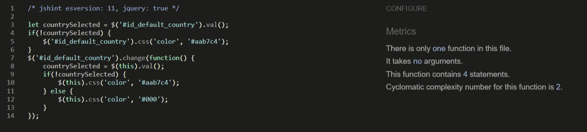
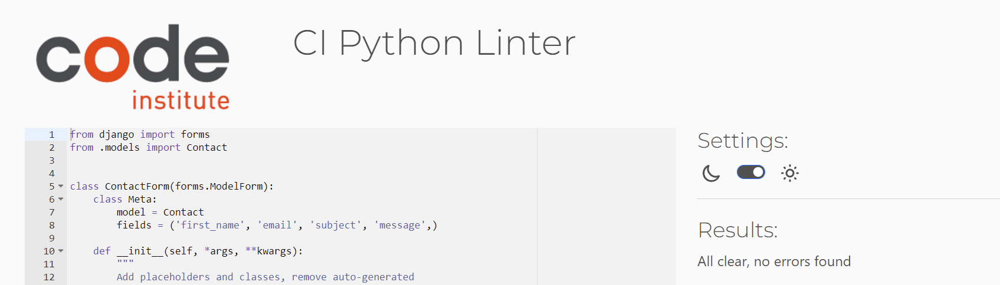
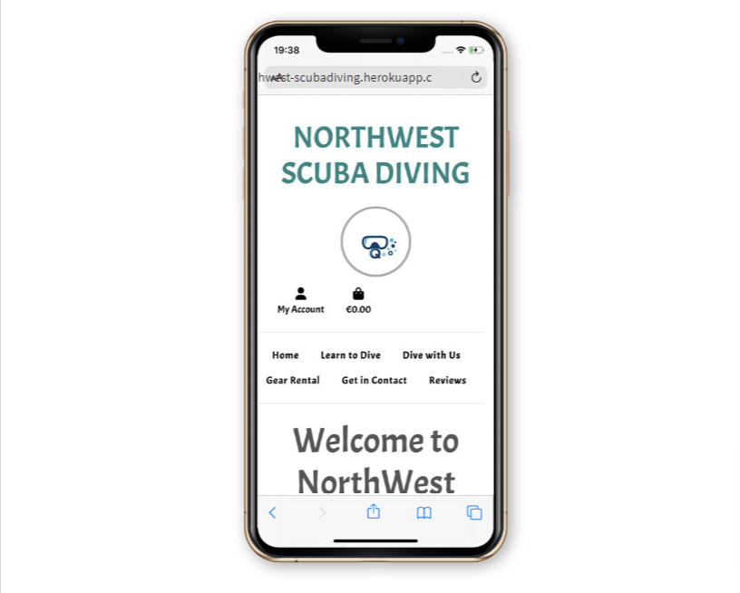

# Testing

## Code Validation

Use the space to discuss code validation for any of your own code files (where applicable).
You are not required to validate external libraries/frameworks, such as imported Bootstrap, Materialize, Font Awesome, etc.

### HTML

I have used the recommended [HTML W3C Validator](https://validator.w3.org) to validate all of my HTML files.

| Page | W3C URL | Screenshot | Notes |
| --- | --- | --- | --- |
| Index.html | https://validator.w3.org/nu/?doc=https%3A%2F%2Fnorthwest-scubadiving.herokuapp.com%2F |  | Warning: Section lacks heading|
|newsletter.html | https://validator.w3.org/nu/?doc=https%3A%2F%2Fnorthwest-scubadiving.herokuapp.com%2Fnewsletter%2F |  | N/A |
| newsletter_signup_success.html | https://validator.w3.org/nu/?doc=https%3A%2F%2Fnorthwest-scubadiving.herokuapp.com%2Fnewsletter%2Fnewsletter_signup_success%2Fl.butler1993%40gmail.com |  | N/A |
| newsletter_unsubscribe | https://validator.w3.org/nu/?doc=https%3A%2F%2Fnorthwest-scubadiving.herokuapp.com%2Fnewsletter%2Fnewsletter_unsubscribe%2Fl.butler1993%40gmail.com |  | N/A |
| add_product.html | https://validator.w3.org/nu/?doc=https%3A%2F%2Fnorthwest-scubadiving.herokuapp.com%2Fproducts%2Fadd%2F |  | INFO: Trailing slash, WARNING: Lacks heading |
| courses.html | https://validator.w3.org/nu/?doc=https%3A%2F%2Fnorthwest-scubadiving.herokuapp.com%2Fproducts%2Fcourses%2F%3Fcategory%3Dcourses |  | N/A |
| edit_product.html | https://validator.w3.org/nu/?doc=https%3A%2F%2Fnorthwest-scubadiving.herokuapp.com%2Fproducts%2Fedit%2F9%2F |  | INFO: Trailing slash, WARNING: Lacks heading |
| gear.html | https://validator.w3.org/nu/?doc=https%3A%2F%2Fnorthwest-scubadiving.herokuapp.com%2Fproducts%2Fgear%2F%3Fcategory%3Dgear_rental |  | N/A |
| orders.html | https://validator.w3.org/nu/?doc=https%3A%2F%2Fnorthwest-scubadiving.herokuapp.com%2Fproducts%2Forders%2F |  | INFO: Trailing slash, WARNING: Lacks heading |
| product_detail.html | https://validator.w3.org/nu/?doc=https%3A%2F%2Fnorthwest-scubadiving.herokuapp.com%2Fproducts%2F5%2F |  | N/A |
| qualified.html | https://validator.w3.org/nu/?doc=https%3A%2F%2Fnorthwest-scubadiving.herokuapp.com%2Fproducts%2Fqualified%2F%3Fcategory%3Dqualified_diver |  | N/A |
| profile.html | https://validator.w3.org/nu/?doc=https%3A%2F%2Fnorthwest-scubadiving.herokuapp.com%2Fprofile%2F |  | INFO: Trailing slash, WARNING: Lacks heading |
| reviews.html | https://validator.w3.org/nu/?doc=https%3A%2F%2Fnorthwest-scubadiving.herokuapp.com%2Freviews%2F |  | N/A |
| submit_review.html | https://validator.w3.org/nu/?doc=https%3A%2F%2Fnorthwest-scubadiving.herokuapp.com%2Freviews%2Fsubmit_review |  | INFO: Trailing slash, WARNING: Lacks heading |
| contact.html | https://validator.w3.org/nu/?doc=https%3A%2F%2Fnorthwest-scubadiving.herokuapp.com%2Fcontact%2F |  | N/A |
| contact_request_success.html | https://validator.w3.org/nu/?doc=https%3A%2F%2Fnorthwest-scubadiving.herokuapp.com%2Fcontact%2Fcontact_request_success%2F8C45853228084254988539FD58BCB154 |  | N/A |
| bag.html | https://validator.w3.org/nu/?doc=https%3A%2F%2Fnorthwest-scubadiving.herokuapp.com%2Fbag%2F |  | N/A |
| 404.html | https://validator.w3.org/nu/#textarea |  | N/A |
| --- | --- | --- | --- |

### CSS

I have used the recommended [Kigsaw Validator](https://jigsaw.w3.org/css-validator/validator) to validate all of my CSS files.

| File | Jigsaw URL | Screenshot | Notes |
| --- | --- | --- | --- |
| style.css | [Jigsaw](https://jigsaw.w3.org/css-validator/validator?uri=https%3A%2F%2Fnorthwest-scubadiving.herokuapp.com%2F&profile=css3svg&usermedium=all&warning=1&vextwarning=&lang=en) |  | Pass: No Errors |
| checkout.css | n/a |  | Pass: No Errors |
| --- | --- | --- | --- |

### JavaScript

I have used the recommended [JShint Validator](https://jshint.com) to validate all of my JS files.

| File | Screenshot | Notes |
| --- | --- | --- |
| stripe_elements.js |  | Unidentified Variable: Stripe |
| countryfield.js |  | Pass: No Errors |
| --- | --- | --- |

### Python

I have used the recommended [CI Python Linter](https://pep8ci.herokuapp.com) to validate all of my Python files.

| File | CI URL | Screenshot | Notes |
| --- | --- | --- | --- |
| BAG contexts.py | [CI PEP8](https://pep8ci.herokuapp.com/https://raw.githubusercontent.com/lisa-butler/Northwest-Scuba-Diving/main/bag/contexts.py) |  | No Errors |
| BAG urls.py | [CI PEP8](https://pep8ci.herokuapp.com/https://raw.githubusercontent.com/lisa-butler/Northwest-Scuba-Diving/main/bag/urls.py) |  | No Errors |
| BAG views.py | [CI PEP8](https://pep8ci.herokuapp.com/https://raw.githubusercontent.com/lisa-butler/Northwest-Scuba-Diving/main/bag/views.py) |  | No Errors |
| ChECKOUT admin.py | [CI PEP8](https://pep8ci.herokuapp.com/https://raw.githubusercontent.com/lisa-butler/Northwest-Scuba-Diving/main/checkout/a.py) |  | No Errors |
| CHECKOUT forms.py | [CI PEP8](https://pep8ci.herokuapp.com/https://raw.githubusercontent.com/lisa-butler/Northwest-Scuba-Diving/main/checkout/forms.py) |  | No Errors |
| CHECKOUT models.py | [CI PEP8](https://pep8ci.herokuapp.com/https://raw.githubusercontent.com/lisa-butler/Northwest-Scuba-Diving/main/checkout/models.py) |  | No Errors |
| CHECKOUT signals.py | [CI PEP8](https://pep8ci.herokuapp.com/https://raw.githubusercontent.com/lisa-butler/Northwest-Scuba-Diving/main/checkout/signals.py) |  | No Errors |
| CHECKOUT urls.py | [CI PEP8](https://pep8ci.herokuapp.com/https://raw.githubusercontent.com/lisa-butler/Northwest-Scuba-Diving/main/checkout/urls.py) |  | No Errors |
| CHECKOUT views.py| [CI PEP8](https://pep8ci.herokuapp.com/https://raw.githubusercontent.com/lisa-butler/Northwest-Scuba-Diving/main/checkout/views.py) |  | No Errors |
| CHECKOUT webhook_handler.py | [CI PEP8](https://pep8ci.herokuapp.com/https://raw.githubusercontent.com/lisa-butler/Northwest-Scuba-Diving/main/checkout/webhook_handler.py) |  | No Errors |
| CHECKOUT webhooks.py | [CI PEP8](https://pep8ci.herokuapp.com/https://raw.githubusercontent.com/lisa-butler/Northwest-Scuba-Diving/main/checkout/webhooks.py) |  |  |
| CONTACT admin.py | [CI PEP8](https://pep8ci.herokuapp.com/https://raw.githubusercontent.com/lisa-butler/Northwest-Scuba-Diving/main/contact/admin.py) |  | No Errors |
| CONTACT forms.py | [CI PEP8](https://pep8ci.herokuapp.com/https://raw.githubusercontent.com/lisa-butler/Northwest-Scuba-Diving/main/contact/forms.py) |  | No Errors |
| CONTACT models.py | [CI PEP8](https://pep8ci.herokuapp.com/https://raw.githubusercontent.com/lisa-butler/Northwest-Scuba-Diving/main/contact/models.py) |  | No Errors |
| CONTACT urls.py | [CI PEP8](https://pep8ci.herokuapp.com/https://raw.githubusercontent.com/lisa-butler/Northwest-Scuba-Diving/main/contact/urls.py) |  | No Errors |
| CONTACT views.py | [CI PEP8](https://pep8ci.herokuapp.com/https://raw.githubusercontent.com/lisa-butler/Northwest-Scuba-Diving/main/contact/views.py) |  | No Errors |
| HOME urls.py | [CI PEP8](https://pep8ci.herokuapp.com/https://raw.githubusercontent.com/lisa-butler/Northwest-Scuba-Diving/main/home/urls.py) |  | No Errors |
| HOME views.py | [CI PEP8](https://pep8ci.herokuapp.com/https://raw.githubusercontent.com/lisa-butler/Northwest-Scuba-Diving/main/home/views.py) |  | No Errors |
| NEWSLETTER forms.py | [CI PEP8](https://pep8ci.herokuapp.com/https://raw.githubusercontent.com/lisa-butler/Northwest-Scuba-Diving/main/newsletter/forms.py) |  | No Errors |
| NEWSLETTER models.py | [CI PEP8](https://pep8ci.herokuapp.com/https://raw.githubusercontent.com/lisa-butler/Northwest-Scuba-Diving/main/newsletter/models.py) |  | No Errors |
| NEWSLETTER urls.py | [CI PEP8](https://pep8ci.herokuapp.com/https://raw.githubusercontent.com/lisa-butler/Northwest-Scuba-Diving/main/newsletter/urls.py) |  | No Errors |
| NEWSLETTER views.py | [CI PEP8](https://pep8ci.herokuapp.com/https://raw.githubusercontent.com/lisa-butler/Northwest-Scuba-Diving/main/newsletter/views.py) |  | No Errors |
| NORTHWEST SCUBADIVING settings.py | [CI PEP8](https://pep8ci.herokuapp.com/https://raw.githubusercontent.com/lisa-butler/Northwest-Scuba-Diving/main/northwest_scuba_diving/settings.py) |  | No Errors |
| NORTHWEST SCUBADIVING urls.py | [CI PEP8](https://pep8ci.herokuapp.com/https://raw.githubusercontent.com/lisa-butler/Northwest-Scuba-Diving/main/northwest_scuba_diving/urls.py) |  | No Errors |
| NORTHWEST SCUBADIVING views.py | [CI PEP8](https://pep8ci.herokuapp.com/https://raw.githubusercontent.com/lisa-butler/Northwest-Scuba-Diving/main/northwest_scuba_diving/views.py) |  | No Errors |
| PRODUCTS admin.py | [CI PEP8](https://pep8ci.herokuapp.com/https://raw.githubusercontent.com/lisa-butler/Northwest-Scuba-Diving/main/products/admin.py) |  | No Errors |
| PRODUCTS forms.py | [CI PEP8](https://pep8ci.herokuapp.com/https://raw.githubusercontent.com/lisa-butler/Northwest-Scuba-Diving/main/products/froms.py) |  | No Errors |
| PRODUCTS models.py | [CI PEP8](https://pep8ci.herokuapp.com/https://raw.githubusercontent.com/lisa-butler/Northwest-Scuba-Diving/main/products/models.py) |  | No Errors |
| PRODUCTS urls.py | [CI PEP8](https://pep8ci.herokuapp.com/https://raw.githubusercontent.com/lisa-butler/Northwest-Scuba-Diving/main/products/urls.py) |  | No Errors |
| PRODUCTS views.py | [CI PEP8](https://pep8ci.herokuapp.com/https://raw.githubusercontent.com/lisa-butler/Northwest-Scuba-Diving/main/products/views.py) |  | No Errors |
| PRODUCTS widgets.py | [CI PEP8](https://pep8ci.herokuapp.com/https://raw.githubusercontent.com/lisa-butler/Northwest-Scuba-Diving/main/products/widgets.py) |  | No Errors |
| PROFILES admin.py | [CI PEP8](https://pep8ci.herokuapp.com/https://raw.githubusercontent.com/lisa-butler/Northwest-Scuba-Diving/main/profiles/admin.py) |  | No Errors |
| PROFILES forms.py | [CI PEP8](https://pep8ci.herokuapp.com/https://raw.githubusercontent.com/lisa-butler/Northwest-Scuba-Diving/main/profiles/forms.py) |  | No Errors |
| PROFILES models.py | [CI PEP8](https://pep8ci.herokuapp.com/https://raw.githubusercontent.com/lisa-butler/Northwest-Scuba-Diving/main/profiles/models.py) |  | No Errors |
| PROFILES urls.py | [CI PEP8](https://pep8ci.herokuapp.com/https://raw.githubusercontent.com/lisa-butler/Northwest-Scuba-Diving/main/profiles/urls.py) |  | No Errors |
| PROFILES views.py | [CI PEP8](https://pep8ci.herokuapp.com/https://raw.githubusercontent.com/lisa-butler/Northwest-Scuba-Diving/main/profiles/views.py) |  | No Errors |
| REVIEWS forms.py | [CI PEP8](https://pep8ci.herokuapp.com/https://raw.githubusercontent.com/lisa-butler/Northwest-Scuba-Diving/main/reviews/forms.py) |  | No Errors |
| REVIEWS models.py | [CI PEP8](https://pep8ci.herokuapp.com/https://raw.githubusercontent.com/lisa-butler/Northwest-Scuba-Diving/main/reviews/models.py) |  | No Errors |
| REVIEWS urls.py | [CI PEP8](https://pep8ci.herokuapp.com/https://raw.githubusercontent.com/lisa-butler/Northwest-Scuba-Diving/main/reviews/urls.py) |  | No Errors |
| REVIEWS views.py | [CI PEP8](https://pep8ci.herokuapp.com/https://raw.githubusercontent.com/lisa-butler/Northwest-Scuba-Diving/main/reviews/views.py) |  | No Errors |
| --- | --- | --- | --- |

## Browser Compatibility

Browser compatability was checked using both my own device (an Acer Aspire A514-52) which is running Google Chrome and with **[BrowserStack](https://www.browserstack.com/)**.

Compatability was confirmed on the following;

I've tested my deployed project on multiple browsers to check for compatibility issues.

| Browser | Screenshot | Notes |
| --- | --- | --- |
| Chrome |  | Works as expected |
| Firefox |  | Works as expected |
| Edge |  | Works as expected |
| Safari | Tested on Browserstack | Minor CSS differences |
| Opera | Tested on Browserstack | Minor differences |
| --- | --- | --- |

Compatabilty with both Android and IOS devices was checked as well.

**Performance Testing:**

Performace testing was checked using Google Lighthouse also with a very good result.

**Responsivness:**

I've tested my deployed project on multiple devices to check for responsiveness issues.

| Device | Screenshot | Notes |
| --- | --- | --- |
| Mobile Iphone X (BrowserStack) |  | Works as expected |
| Mobile Samsugng Galaxy Note 10 (BrowserStack) |  | Works as expected |
| Tablet (BrowserStack) |  | Works as expected |
| Desktop |  | Works as expected |

The application was also responsive on larger and smaller screens and worked on different devices and browsers.

**Manual Testing:**

### Testing links and forms:

* Navigation links are working and bring the user to the correct page. ☑
* The home page "Courses†and "Dives" links are working and take user to the correct pages. ☑
* The social media links all work and take users to the correct social media. ☑
* The title of the page "Northwest Scuba Diving" works as a link to return the user to home. ☑
* Login and logout functionality works correctly. ☑
* The registration form has error handling built in so the user must make the correct inputs.☑
* The forms all redirect appropriately. ☑
* Email confirmation is working correctly. ☑
* Customers Orders are updating when a user makes an order, displaying the new order. ☑
* Newsletter subscribe and unsubscribe functionality is working correctly. ☑

### Testing security elements:

* When the user is not logged in they sign up for the newsletter or submit a review. ☑
* The user cannot create multiple accounts with the same email or username. ☑
* The user can edit and delete items in their basket. ☑
* The user cannot subscribe for the newsletter multiple times with the same email. ☑
* The user cannot subscribe someone else to the newsletter. ☑
* The admin of the site can see all orders that have been placed, those without admin privelages cannot see this. ☑
* The site admin can add and edit products, those without admin status cannot do this. ☑

### Testing other elements:

* Images when used loaded correctly. ☑
* Product images load correctly and appropriately for thir assigned product. ☑
* Navigation of the application is intuitive. ☑
* When the user is logged in the options change from login or register to my profile, newsletter and logout. ☑
* When the user is not logged in the option to login or register shows. ☑

## Lighthouse Audit

I've tested my deployed project using the Lighthouse Audit tool to check for any major issues.

| Page | Size | Screenshot | Notes |
| --- | --- | --- | --- |
| Home | Desktop |  | Few warnings |
| Bag | Desktop |  | Few warnings |
| Contact | Desktop |  | Few warnings |
| Products | Desktop |  | Few warnings |
| Reviews | Desktop |  | Few warnings |

The same reoccuring issues were seen throughout. They were minor so not dealt with for this submission. However if the site were to be a live site, i would apply some more time to fix them.

**Accessibility Testing:**

Accessibility testing was done through Google LightHouse. The result was 95%. The only issue noted being that the background and foreground do not have sufficenient contrast in some small areas.I chose to leave this as it was in very minor areas.

Areas with known errors can be seen below

## Defensive Programming

Defensive programming (defensive design) is extremely important!

When building projects that accept user inputs or forms, you should always test the level of security for each.
Examples of this could include (not limited to):

Forms:
- Users cannot submit an empty form
- Users must enter valid email addresses

PP3 (Python-only):
- Users must enter a valid letter/word/string when prompted
- Users must choose from a specific list only

Flask/Django:
- Users cannot brute-force a URL to navigate to a restricted page
- Users cannot perform CRUD functionality while logged-out
- User-A should not be able to manipulate data belonging to User-B, or vice versa
- Non-Authenticated users should not be able to access pages that require authentication
- Standard users should not be able to access pages intended for superusers

You'll want to test all functionality on your application, whether it's a standard form,
or uses CRUD functionality for data manipulation on a database.
Make sure to include the `required` attribute on any form-fields that should be mandatory.
Try to access various pages on your site as different user types (User-A, User-B, guest user, admin, superuser).

You should include any manual tests performed, and the expected results/outcome.

Defensive programming was manually tested with the below user acceptance testing:

| Page | User Action | Expected Result | Pass/Fail | Comments |
| --- | --- | --- | --- | --- |
| Home Page | | | | |
| | Click on Logo | Redirection to Home page | Pass | |
| | Click on Home link in navbar | Redirection to Home page | Pass | |
| Gallery Page | | | | |
| | Click on Gallery link in navbar | Redirection to Gallery page | Pass | |
| | Load gallery images | All images load as expected | Pass | |
| Contact Page | | | | |
| | Click on Contact link in navbar | Redirection to Contact page | Pass | |
| | Enter first/last name | Field will accept freeform text | Pass | |
| | Enter valid email address | Field will only accept email address format | Pass | |
| | Enter message in textarea | Field will accept freeform text | Pass | |
| | Click the Submit button | Redirects user to form-dump | Pass | User must click 'Back' button to return |
| Sign Up | | | | |
| | Click on Sign Up button | Redirection to Sign Up page | Pass | |
| | Enter valid email address | Field will only accept email address format | Pass | |
| | Enter valid password (twice) | Field will only accept password format | Pass | |
| | Click on Sign Up button | Asks user to confirm email page | Pass | Email sent to user |
| | Confirm email | Redirects user to blank Sign In page | Pass | |
| Log In | | | | |
| | Click on the Login link | Redirection to Login page | Pass | |
| | Enter valid email address | Field will only accept email address format | Pass | |
| | Enter valid password | Field will only accept password format | Pass | |
| | Click Login button | Redirects user to home page | Pass | |
| Log Out | | | | |
| | Click Logout button | Redirects user to logout page | Pass | Confirms logout first |
| | Click Confirm Logout button | Redirects user to home page | Pass | |
| Profile | | | | |
| | Click on Profile button | User will be redirected to the Profile page | Pass | |
| | Click on the Edit button | User will be redirected to the edit profile page | Pass | |
| | Click on the My Orders link | User will be redirected to the My Orders page | Pass | |
| | Brute forcing the URL to get to another user's profile | User should be given an error | Pass | Redirects user back to own profile |

Repeat for all other tests, as applicable to your own site.
The aforementioned tests are just an example of a few different project scenarios.

## User Story Testing

Testing user stories is actually quite simple, once you've already got the stories defined on your README.

Most of your project's **features** should already align with the **user stories**,
so this should as simple as creating a table with the user story, matching with the re-used screenshot
from the respective feature.

As a customer i want to be able to checkout and purchase my items so that i can complete my transaction on this site. ☑
As a customer i can view my order history in my account so that i can keep track of my orders. ☑
As a customer i want to be able to log into my account so that the checkout experience is faster and so that i can see my orders. ☑
As a customer i want to receive confirmation that my order has been taken so that i know that my payment has gone through. ☑
As a customer i want to be able to remove items from my cart so that i can discard items i do not wish to purchase. ☑
As a customer i want to be able to add items (dive trips/packages etc) to my cart so that i can add several things before checking out. ☑
As a customer i want to be able to read detailed and concise information about the available options so that i can make an informed choice about my purchase. ☑
As a customer, I want to be able to browse the available dive trips/training/packages to find the one best suited to my needs/wants. ☑

### New Site Users

- As a new site user, I would like to register for an account, so that I can save my details to make checkout smoother. ☑
- As a new site user, I would like to register for an account, so that I can login and view my orders. ☑
- As a new site user, I would like to be able to see reviews, so that I can decide if i want to dive with this dive school. ☑
- As a new site user, I would like to be able to contact the dive school, so that I can have my questions answered. ☑

### Returning Site Users

- As a returning site user, I would like to be able to sign in, so that I can view my previous orders. ☑
- As a returning site user, I would like to be able to sign up for a newsletter, so that I can be kept updated about upcoming courses and dive trips. ☑
- As a returning site user, I would like to unsubscribe from a newsletter, so that I can no longer recieve them. ☑
- As a returning site user, I would like to be able to submit  review, so that I can review my experience at the dive school. ☑
- As a returning site user, I would like to be able to contact the dive school, so that I can organise my dives/courses. ☑

### Site Admin

- As a site administrator, I should be able to view customers orders, so that I can take note of numbers signed up for courses/dives. ☑
- As a site administrator, I should be able to add, remove and edit products, so that I can keep the avalible courses up to date and add things as they come up. ☑

## Bugs

It's very important to document any bugs you've discovered while developing the project.
Make sure to include any necessary steps you've implemented to fix the bug(s) as well.

For JavaScript and Python applications, it's best to screenshot the errors to include them as well.

**PRO TIP**: screenshots of bugs are extremely helpful, and go a long way!

- JS Uncaught ReferenceError: `foobar` is undefined/not defined

    

    - To fix this, I _____________________.

- JS `'let'` or `'const'` or `'template literal syntax'` or `'arrow function syntax (=>)'` is available in ES6 (use `'esversion: 11'`) or Mozilla JS extensions (use moz).

    

    - To fix this, I _____________________.

- Python `'ModuleNotFoundError'` when trying to import module from imported package

    

    - To fix this, I _____________________.

- Django `TemplateDoesNotExist` at /appname/path appname/template_name.html

    

    - To fix this, I _____________________.

- Python `E501 line too long` (93 > 79 characters)

    

    - To fix this, I _____________________.

### GitHub **Issues**

An improved way to manage bugs is to use the built-in **Issues** tracker on your GitHub repository.
To access your Issues, click on the "Issues" tab at the top of your repository.
Alternatively, use this link: https://github.com/lisa-butler/Northwest-Scuba-Diving/issues

If using the Issues tracker for your bug management, you can simplify the documentation process.
Issues allow you to directly paste screenshots into the issue without having to first save the screenshot locally,
then uploading into your project.

You can add labels to your issues (`bug`), assign yourself as the owner, and add comments/updates as you progress with fixing the issue(s).

Once you've sorted the issue, you should then "Close" it.

When showcasing your bug tracking for assessment, you can use the following format:

**Fixed Bugs**

All previously closed/fixed bugs can be tracked [here](https://github.com/lisa-butler/Northwest-Scuba-Diving/issues?q=is%3Aissue+is%3Aclosed).

| Bug | Status |
| --- | --- |
| [JS Uncaught ReferenceError: `foobar` is undefined/not defined](https://github.com/lisa-butler/Northwest-Scuba-Diving/issues/1) | Closed |
| [Python `'ModuleNotFoundError'` when trying to import module from imported package](https://github.com/lisa-butler/Northwest-Scuba-Diving/issues/2) | Closed |
| [Django `TemplateDoesNotExist` at /appname/path appname/template_name.html](https://github.com/lisa-butler/Northwest-Scuba-Diving/issues/3) | Closed |

**Open Issues**

Any remaining open issues can be tracked [here](https://github.com/lisa-butler/Northwest-Scuba-Diving/issues).

| Bug | Status |
| --- | --- |
| [JS `'let'` or `'const'` or `'template literal syntax'` or `'arrow function syntax (=>)'` is available in ES6 (use `'esversion: 11'`) or Mozilla JS extensions (use moz).](https://github.com/lisa-butler/Northwest-Scuba-Diving/issues/4) | Open |
| [Python `E501 line too long` (93 > 79 characters)](https://github.com/lisa-butler/Northwest-Scuba-Diving/issues/5) | Open |

## Unfixed Bugs

You will need to mention unfixed bugs and why they were not fixed.
This section should include shortcomings of the frameworks or technologies used.
Although time can be a big variable to consider, paucity of time and difficulty understanding
implementation is not a valid reason to leave bugs unfixed.

If you've identified any unfixed bugs, no matter how small, be sure to list them here.
It's better to be honest and list them, because if it's not documented and an assessor finds the issue,
they need to know whether or not you're aware of them as well, and why you've not corrected/fixed them.

Some examples:

- On devices smaller than 375px, the page starts to have `overflow-x` scrolling.

    

    - Attempted fix: I tried to add additional media queries to handle this, but things started becoming too small to read.

- For PP3, when using a helper `clear()` function, any text above the height of the terminal does not clear, and remains when you scroll up.

    

    - Attempted fix: I tried to adjust the terminal size, but it only resizes the actual terminal, not the allowable area for text.

- When validating HTML with a semantic `section` element, the validator warns about lacking a header `h2-h6`. This is acceptable.

    

    - Attempted fix: this is a known warning and acceptable, and my section doesn't require a header since it's dynamically added via JS.

If you legitimately cannot find any unfixed bugs or warnings, then use the following sentence:

There are no remaining bugs that I am aware of.
